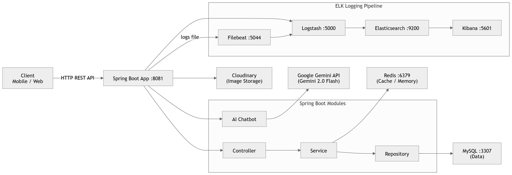

# 🎬 Cinema Booking System - Enterprise Grade Movie Platform

[](https://www.oracle.com/java/technologies/javase/jdk21-archive-downloads.html)
[](https://spring.io/projects/spring-boot)
[](#-kiểm-thử--chất-lượng-code)
[](https://railway.app/)
[](https://aiven.io/)

Hệ thống đặt vé xem phim trực tuyến thời gian thực, tích hợp **AI Agent**, thanh toán **VNPay**, và hệ thống giám sát **ELK Stack**.

---

## 🔗 Quick Links

- 🌐 **Live Demo (Swagger UI):** [https://booking-cinema-production.up.railway.app/swagger-ui/index.html](https://booking-cinema-production.up.railway.app/swagger-ui/index.html)
- 🤖 **AI Chatbot:** `/api/v1/chatbot/chat`
- 📔 **API Docs:** `/v3/api-docs`

---

## ✨ Tính Năng Nổi Bật

### 🤖 AI Agent (Trợ Lý Ảo Gemini)
Sử dụng **Spring AI** kết hợp với **Gemini 2.0 Flash**, chatbot có khả năng gọi 15 công cụ (Function Calling) để tra cứu lịch chiếu, giá vé, kiểm tra ghế trống và gợi ý phim thông minh.

### 💳 Thanh Toán & Đặt Vé Real-time
- **Seat Locking:** Cơ chế khóa ghế thông minh chống đặt trùng.
- **VNPay Integration:** Tích hợp thanh toán QR Code và thẻ ngân hàng thực tế.
- **QR Ticket:** Tự động tạo mã QR vé và gửi Email sau khi thanh toán.

---

## 🏗 Kiến Trúc Hệ Thống

<p align="center">
  
</p>

---

## 🛠 Công Nghệ Sử Dụng

| Thành phần | Công nghệ tiêu biểu |
|---|---|
| **Core Backend** | Java 21, Spring Boot 3.3.5, Spring Security (JWT) |
| **AI Engine** | Spring AI, Google Gemini 2.0 Flash |
| **Data Storage** | Aiven MySQL 8.0, Aiven Valkey (Redis 7) |
| **Logging** | ELK Stack (Elasticsearch, Logstash, Kibana, Filebeat) |
| **Payment** | VNPay Sandbox integration |
| **Infrastructure** | Docker, Railway Cluster |

---

## 🚦 Chiến Lược Rate Limit (Tiered Strategy)

| Tầng | API Targets | Hạn mức |
|---|---|---|
| **Strict** | Auth, Booking, Payment | 3–5 req/phút |
| **Moderate** | Statistics, Chatbot, Promotion | 10–20 req/phút |
| **Global** | Toàn bộ các API | 100 req/phút |

---

## 📡 API Endpoints (Hệ Thống 20+ Module)

| Module | Base Path | Chức năng chính |
|---|---|---|
| **Auth** | `/api/v1/auth` | Đăng nhập, Đăng ký, OTP, Identity |
| **Movies** | `/api/v1/movies` | Quản lý phim, đạo diễn, diễn viên |
| **Cinemas** | `/api/v1/cinemas` | Quản lý rạp và khu vực |
| **Rooms/Seats** | `/api/v1/rooms` | Sơ đồ phòng chiếu và quản lý ghế |
| **Seat Types** | `/api/v1/seat-types` | Cấu hình giá VIP/Couple/Standard |
| **Showtimes** | `/api/v1/showtimes` | Lịch chiếu, ngôn ngữ, giá sàn |
| **Showtime Seats**| `/api/v1/showtime-seats`| Trạng thái ghế theo suất chiếu (Real-time) |
| **Bookings** | `/api/v1/bookings` | Quy trình đặt vé, thanh toán |
| **Tickets** | `/api/v1/tickets` | Quản lý vé và mã QR |
| **Payments** | `/api/v1/payments` | VNPay Checkout & IPN Callback |
| **Promotions** | `/api/v1/promotions` | Voucher, Coupon, giảm giá |
| **Products/Combos**| `/api/v1/combos` | Bắp nước và các gói Combo |
| **Chatbot** | `/api/v1/chatbot` | Trợ lý ảo Google Gemini |
| **Statistics** | `/api/v1/statistics` | Thống kê doanh thu, tỷ lệ lấp đầy |
| **Dashboard** | `/api/v1/dashboard` | Tổng quan dành cho Admin |
| **Cloudinary** | `/api/v1/upload` | Quản lý kho ảnh Cloud |

---

## 🚀 Hướng Dẫn Cài Đặt (Quick Start)

### 1. Môi trường
Sao chép `.env.example` -> `.env` và điền các API Key.

### 2. Chạy ứng dụng
```bash
./mvnw clean package -DskipTests
docker compose up -d
```

### 🔐 Tài khoản Admin mặc định
- **User:** `admin` | **Pass:** `admin`

---

## 🧪 Kiểm Thử & Chất Lượng Code
- **Coverage:** >95% cho logic nghiệp vụ.
- **Standards:** Tuân thủ RESTful API và Clean Code.

---

## 📝 License & Contact
- **Author:** [Hiến - hien1172004](https://github.com/hien1172004)